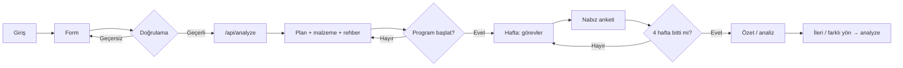

# HobbyBuddy AI — User Flow

Bu doküman, kullanıcının uygulamada izlediği ana yolu tanımlar. Ürün vizyonu: bütçe, zaman ve ilgi alanlarına göre sürdürülebilir hobi önerisi ve plan.

---

## Ana akış (özet)

1. **Giriş** — Arayüz ve kısa ürün mesajı.
2. **Girdi** — İlgi alanları, haftalık süre, aylık bütçe (doğrulama).
3. **Analiz** — `POST /api/analyze` ile Gemini; yapılandırılmış plan.
4. **Çıktı** — Hobi seçenekleri, 4 haftalık görevler, kaynaklar, malzemeler, yolculuk rehberi; isteğe bağlı link doğrulama (`/api/verify-urls`).
5. **Program** — “Programı başlat” ile yerel takip: **aktif hafta sihirbazı** — önce o haftanın görevleri, görevler bitince nabız anketi, sonra bir sonraki hafta. **Geri** ile tamamlanmış haftalara salt okunur bakış. **Rozetler** üst çubuktan; yeni rozet ortada kısa bildirim (bulanık arka plan).
6. **Yol sonu** — Dört hafta ve anketler tamamlanınca özet/analiz; **ileri seviye** veya **farklı hobi yönü** için yeni analiz (aynı form özetiyle; sunucuya özet metin gider).
7. **Dönüş** — Son plan ve form özeti saklanır; uygun zamanda sayfa yenilense sonuç geri gelir.

---

## Adım adım detay

### 1. Giriş (Landing)

- Kullanıcı uygulamayı açar (web, mobil tarayıcı dahil).
- Kısa ürün mesajı ve “Başla” / forma yönlendiren net bir çağrı görür.
- İsteğe bağlı: ne sunulduğuna dair tek ekranlık özet (hobi önerisi + plan + malzeme).

### 2. Girdi (Onboarding form)

Kullanıcı şu bilgileri sağlar:

| Alan | Amaç |
|------|------|
| İlgi alanları | AI’nın uygun hobi önermesi |
| Haftalık süre (saat) | Gerçekçi 4 haftalık yoğunluk |
| Aylık bütçe | Malzeme listesinin limiti |

Doğrulama: boş alan, mantıksız değerler (ör. negatif bütçe) engellenir veya uyarı verilir.

### 3. Analiz (Arka plan)

- İstemci `POST /api/analyze` ile JSON gönderir (ilgi, süre, bütçe; isteğe bağlı `chosenHobby`, `programFeedback`, `journeyContinuation`).
- Sunucu Gemini’yi yapılandırılmış şema ile çağırır.
- Yükleme katmanı ve hata mesajları kullanıcıya gösterilir.

### 4. Çıktı (Sonuç ekranı)

- **Hobi seçenekleri** — Kartlarla alternatifler; tıklanınca aynı profille o hobi için yeni plan.
- **4 haftalık yol haritası** — Program başlamadan dört haftanın özeti listelenir; program başlayınca ekranda **yalnızca ilgili haftanın** görev/anket akışı (sihirbaz); geçmiş haftalar **Geri** ile görüntülenir.
- **Kaynaklar ve malzemeler** — Plan detayında; program modunda haftaya göre daraltılabilir / katlanabilir bölümler.
- **Yolculuk paneli** — Program başlayınca: hafta gezgini (Geri/İleri), aşama etiketi (görevler / nabız / tamam); yol tamamlanınca analiz ve yeni plan düğmeleri.

Yeni tam analiz: formdan “Hobi planımı oluştur” veya yol sonu düğmeleri.

### 5. Program (yolculuk) detayı

- Aktif program yalnızca seçilen hobiyle eşleşen planda geçerlidir.
- Önceki haftanın tüm görevleri bitmeden sonraki hafta içeriği gösterilmez (kilit mesajı).
- Anket zorunlu değildir; kaydedilen yorumlar özet ve API geri bildirim metnine eklenir.

---

## Akış diyagramı

---

## Kenar durumlar

- **API hatası / zaman aşımı:** Kullanıcıya kısa mesaj; analiz için istemde ~55 sn zaman aşımı hedefi.
- **Sadece statik sunucu:** `npx serve` ile `/api/*` yok; tam akış için `vercel dev`.
- **Mobil:** Aynı akış; dokunmatik uyumlu form ve kaydırılabilir sonuç.
