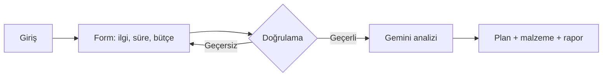

# HobbyBuddy AI — User Flow

Bu doküman, kullanıcının uygulamada izlediği ana yolu tanımlar. Ürün vizyonu: bütçe, zaman ve ilgi alanlarına göre sürdürülebilir hobi önerisi ve plan.

---

## Ana akış (özet)

1. **Giriş** — Kullanıcı temiz ve modern arayüzle karşılanır.
2. **Girdi** — İlgi alanları, haftalık ayırabileceği saat ve aylık bütçe girilir.
3. **Analiz** — Sistem bu verileri Gemini API’ye iletir; yapay zeka hobi eşleşmesi ve planı üretir.
4. **Çıktı** — 4 haftalık adım adım plan, bütçeye uygun malzeme listesi ve gelişim / motivasyon analizi gösterilir.

---

## Adım adım detay

### 1. Giriş (Landing)

- Kullanıcı uygulamayı açar (web, mobil tarayıcı dahil).
- Kısa ürün mesajı ve “Başla” / forma yönlendiren net bir çağrı görür.
- İsteğe bağlı: ne sunulduğuna dair tek ekranlık özet (hobi önerisi + plan + malzeme).

### 2. Girdi (Onboarding form)

Kullanıcı şu bilgileri sağlar:

| Alan | Amaç |
|------|------|
| İlgi alanları | AI’nın uygun hobi önermesi |
| Haftalık süre (saat) | Gerçekçi 4 haftalık yoğunluk |
| Aylık bütçe | Malzeme listesinin limiti |

Doğrulama: boş alan, mantıksız değerler (ör. negatif bütçe) engellenir veya uyarı verilir.

### 3. Analiz (Arka plan)

- Form gönderilir; istemci veriyi güvenli bir uç noktaya (ör. Vercel serverless) iletir.
- Sunucu Gemini API’yi çağırır; prompt’ta kullanıcı verileri ve beklenen çıktı yapısı (plan, liste, rapor) tanımlıdır.
- Yükleme durumu kullanıcıya gösterilir (ör. “Plan hazırlanıyor…”).

### 4. Çıktı (Sonuç ekranı)

Kullanıcı sırayla veya sekmelerle şunları görür:

- **Önerilen hobi** — Kısa gerekçe ile birlikte.
- **4 haftalık yol haritası** — Hafta hafta somut görevler.
- **Malzeme listesi** — Bütçeyi aşmayan temel ihtiyaçlar.
- **Gelişim analizi** — Bu hobide neden ilerleyebileceğine dair motivasyonel özet.

İsteğe bağlı sonraki adımlar (MVP dışı): yeni sorgu, planı paylaşma, yazdırma.

---

## Akış diyagramı

---

## Kenar durumlar

- **API hatası / zaman aşımı:** Anlaşılır hata mesajı ve tekrar dene.
- **Yavaş yanıt:** İlerleme veya bekleme göstergesi; PRD hedefi ~30 saniye civarı tutarlı çıktı.
- **Mobil:** Aynı akış, dokunmatik uyumlu form ve kaydırılabilir sonuç düzeni.
